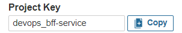
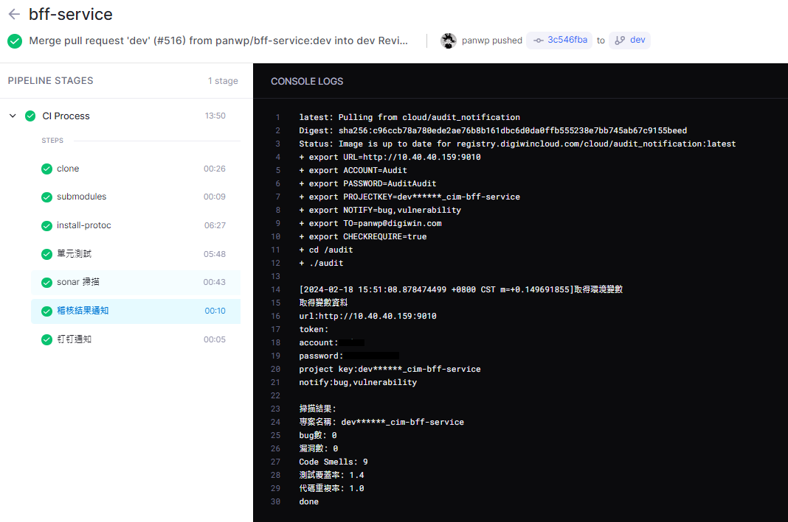

# 稽核結果通知工具

**稽核結果通知** 是一個 CI 流程工具。它設計用於檢查提交代碼的 **bug 數**、**漏洞數**、**單元測試覆蓋率** 是否符合發版需求，並且提供寄發稽核結果郵件功能，此工具可適用於 Drone 與 Jenkins。

## 參數說明
<table style="font-size: 14px">
  <tr>
    <th>必填</th>
    <th>名稱</th>
    <th>說明</th>
    <th>範例</th>
  </tr>
  <tr>
    <td></td>
    <td>IS_READ_DB</td>
    <td>是否讀取 DB (1: 是, 0: 否)，預設為 0</td>
    <td>0</td>
  </tr>
  <tr>
    <td>*</td>
    <td>PROJECTKEY</td>
    <td>sonarqube 中的 project key</td>
    <td>auto-audit</td>
  </tr>
  <tr>
    <td>*</td>
    <td>TO</td>
    <td>收件人，請使用`,`分隔</td>
    <td>yuchi060703@gmail.com</td>
  </tr>
  <tr>
    <td>*</td>
    <td>URL</td>
    <td>sonarqube 網址</td>
    <td></td>
  </tr>
  <tr>
    <td>*</td>
    <td>TOKEN</td>
    <td>sonarqube token，token與帳密擇一填寫</td>
    <td></td>
  </tr>
  <tr>
    <td>*</td>
    <td>ACCOUNT</td>
    <td>sonarqube 帳號，token與帳密擇一填寫</td>
    <td></td>
  </tr>
  <tr>
    <td></td>
    <td>PASSWORD</td>
    <td>sonarqube 密碼</td>
    <td></td>
  </tr>
  <tr>
    <td rowspan="2"></td>
    <td rowspan="2">CHECKREQUIRE</td>
    <td rowspan="2">是否檢查發版要求，預設為0</td>
    <td>true</td>
  </tr>
  <tr>
    <td>1</td>
  </tr>
  <tr>
    <td rowspan="2"></td>
    <td rowspan="2">NOTIFY</td>
    <td rowspan="2">寄送郵件檢查內容 (1: bug, 2: vulnerability, 3: coverage)，請使用`,`分隔，不填則每次執行都會寄送郵件</td>
    <td>bug,vulnerability</td>
  </tr>
  <tr>
    <td>1,2</td>
  </tr>
  <tr>
    <td></td>
    <td>BUG_REQUEST</td>
    <td>bug 發版要求，預設為 0</td>
    <td>0</td>
  </tr>
  <tr>
    <td></td>
    <td>VULNERABILITY_REQUEST</td>
    <td>代碼漏洞發版要求，預設為 0</td>
    <td>0</td>
  </tr>
</table>

> 若 `IS_READ_DB = 1` 則不需輸入 `TOKEN`, `ACCOUNT`, `PASSWORD`, `BUG_REQUEST`, `VULNERABILITY_REQUEST`

> sonarqube project key 可至專案詳情頁面，點選 `Project Information` 查詢
> 


## Drone

本功能用於 `sonar掃描` 流程後

```
  - name: 稽核結果通知
    image: <registry_url>/auto-audit
    settings:
      username:
        from_secret: dockerUsername
      password:
        from_secret: dockerPassword
    commands:
      - export URL=**
      - export ACCOUNT=***
      - export PASSWORD=***
      - export PROJECTKEY=auto-audit
      - export NOTIFY=bug,vulnerability
      - export TO=${DRONE_COMMIT_AUTHOR_EMAIL}
      - export CHECKREQUIRE=true
      - cd /audit
      - ./audit
    when:
      branch:
        - dev
      event:
        - push
        - pull_request
```

> ${DRONE_COMMIT_AUTHOR_EMAIL} 為提交代碼人

<br>

### 運行成果



